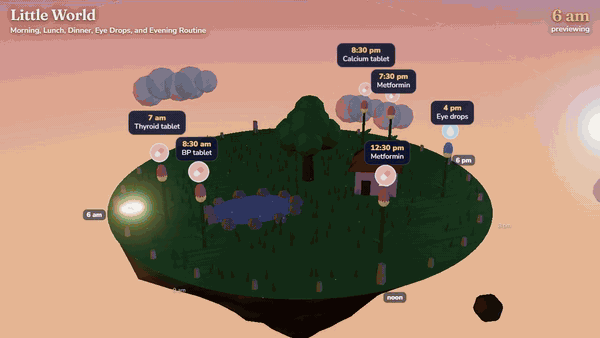
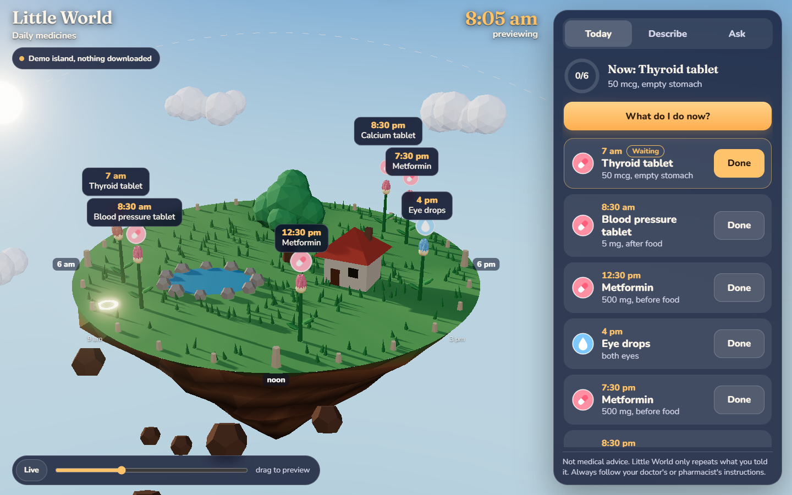
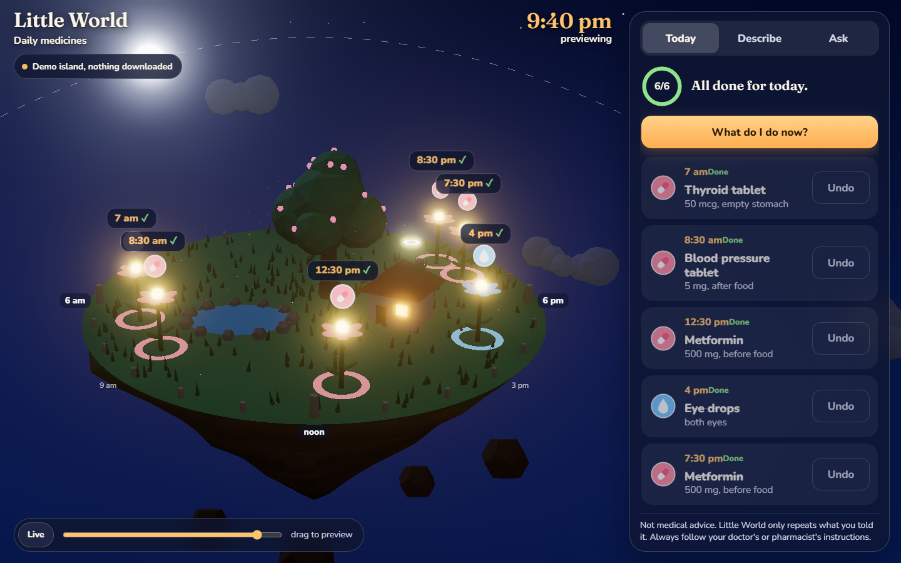
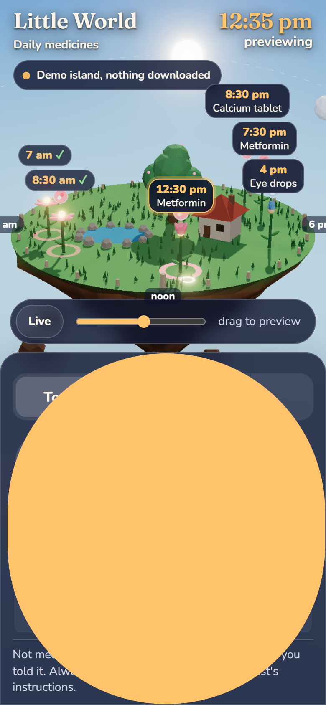
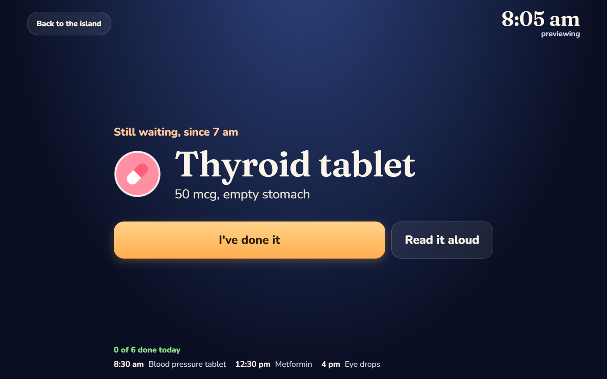
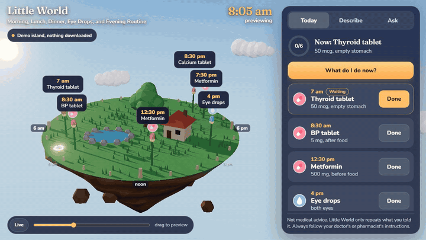

# Little World

**A daily routine tracker shown as a small 3D island.** Describe a routine in plain English ("Thyroid tablet when I wake up, Metformin before lunch and dinner, eye drops at 4 PM"). Gemma, running entirely in the browser, turns it into a validated schedule. Each task is placed on the rim of the island at its time of day, and the sun and moon follow the real clock. Mark a task as done when it is complete. Ask "What's next?" and Gemma answers using only the routine.

Nothing leaves your device. No account, no server, no analytics. After the first load it works offline.

**Live:** https://starknightt.github.io/little-world/ (open `?demo` for the instant demo, no download)



| Day | Night | Phone |
|---|---|---|
|  |  |  |

| Big view | Family setup |
|---|---|
|  |  |

> **Not medical advice.** Little World only repeats what you told it. It does not know about medicines, doses or interactions, and it is told to send those questions to a doctor or pharmacist. Always follow your doctor's or pharmacist's instructions.

## What it does

- **Describe:** enter the routine in plain English. Gemma 2 2B (in a Web Worker, on the GPU through WebGPU) turns it into tasks with a time, a dose, a food rule and an icon. An editable preview is shown before anything is saved, so any time can be corrected and any task removed.
- **Today:** the island shows the day. The sun, and later the moon, moves along an arc from 6 AM on the left to 6 PM on the right. Each task is a marker on the rim at its time. It is highlighted when due, marked when late, and shown as complete when done.
- **"What do I do now?":** a full-screen view with one task in very large type, one large "I've done it" button with undo, and the next few tasks below. It can be set as the default view.
- **Reminders:** an on-screen message and a sound, plus a system notification if allowed. Optionally read aloud with the browser's `speechSynthesis` (no external voice service), and repeated after 20 and 40 minutes while a task is still waiting.
- **Setup by a family member:** the routine can be entered on a computer that runs Gemma, then sent with "Send to another device", which shows a QR code and a link. The routine is encoded in the link's `#` fragment (deflate + base64url), which browsers do not send to a server, so no backend is needed. Opening the link shows the routine and asks for confirmation before replacing anything.
- **Comfort settings:** read reminders aloud, repeat reminders, start in the large view, reduced motion. Reduced motion is on by default when the system requests it.
- **Ask:** "What's next?", "Did I take my eye drops?", "What's left today?". Code computes the facts first (done, waiting and for how long, next), and Gemma only phrases them as a short answer. Medical questions are referred to a doctor or pharmacist.
- **Demo mode:** a precomputed routine (real Gemma output for the sample text), so the app can be tried on any device without a download, with a rule-based Ask.
- **Offline:** a service worker precaches the app (about 0.9 MB). The model (about 1.4 GB) is cached by WebLLM in the browser's Cache Storage after the first download.

## How it works

```
your words
   │
   ▼
Gemma 2 2B (WebLLM, WebGPU, Web Worker)
   │  grammar-constrained decoding (custom EBNF), temperature 0
   ▼
JSON: { said, name, dose, when, food, icon, note } per task
   │
   ├─ quote check   the model must quote your words in "said";
   │                plain code re-reads that quote and overrides the
   │                time or food rule when the quote is unambiguous,
   │                and splits "before lunch and dinner" into two tasks
   ├─ zod           validates the shape, one repair retry if needed
   └─ resolve       maps "after_breakfast" → 8:30, "bedtime" → 22:00 ...
   │
   ▼
editable preview  →  island (Three.js)  →  localStorage
```

Three decisions mattered most:

1. **A grammar, not a JSON schema.** With a plain JSON schema the small models sometimes got stuck emitting whitespace until they ran out of tokens. A hand-written EBNF grammar with fixed separators (`src/grammar.ts`) makes the output valid JSON every time.
2. **Meaning, not clock math.** Small models are bad at turning "after breakfast" into 8:30. So the model picks an anchor like `after_breakfast` or `bedtime` from a fixed list, and code turns it into a time. Only explicit clock times ("at 4 pm") use `at_time`.
3. **Quote first, then check.** Each task carries `said`, the exact words it came from. `src/quote-check.ts` reads that quote with simple regexes and corrects the model when the quote names exactly one moment or food rule. It's dull code, and it's the biggest accuracy win.

## Measured (RTX 4060 laptop GPU, Chrome, WebGPU)

20 hand-written routines in `eval/cases.ts`, scored by `eval/run.mjs` (results in `eval/results-*.json`):

| Gemma 2 2B (q4f16) | Valid JSON | Right task count | Right times | Right food rule |
|---|---|---|---|---|
| Free text, no constraint | 14/20 (17/20 after one repair) | 13/20 | 38/54 | 16/21 |
| Grammar, model alone | 20/20 | n/a | 36/54 | 11/21 |
| **Grammar + quote check (shipped)** | **20/20** | **17/20** | **47/54 (87%)** | **17/21** |

- Download: 1.4 GB once (42 shards). Loading from cache: about 4 to 6 s.
- Speed: about 36 to 55 tokens/s decode, 550 to 700 tokens/s prefill. A typical routine parses in about 4 to 6 s; the six-line medicine sample takes about 8 s.
- Gemma 3 1B (537 MB) was the first choice but didn't work in this WebLLM build: its sliding-window attention config either failed to load or produced unusable output, so the app ships Gemma 2 2B.

## Privacy

- Your routine, your checkmarks and your questions are stored only in `localStorage` on this device (the last 14 days). "Clear everything" wipes them.
- The model runs on your GPU. No text is sent anywhere. The only network requests are the app files from GitHub Pages and the model weights from Hugging Face (via WebLLM) on first use.
- A family-setup link carries the routine inside its `#` fragment, so it's never uploaded, but anyone who has the link can read it. Send it only to the person it's for.
- No cookies, no analytics, no accounts.

## Requirements

- For the real model: a browser with WebGPU and `shader-f16` (recent Chrome or Edge on desktop; some Android phones), about 1.4 GB of free storage and a few GB of GPU memory.
- Everything else (demo mode, the island, reminders, the big view, opening a family-setup link) works on any modern browser, including phones. Without WebGPU the app says so up front and suggests setting the routine up on a computer and sending it over.

## Run it locally

```bash
npm install
npm run dev        # http://localhost:5173
npm run build      # outputs dist/ with base /little-world/
```

Useful URL parameters: `?demo` (sample routine), `?demo&t=21:30` (preview a time), `?demo&done=3`, `?capture&orbit=0.3` (UI-free camera for recordings).

Checks: `npm run build && npx vite preview`, then `node tools/polish-test.mjs` (big view, share link round trip, no-WebGPU fallback, desktop and mobile, fails on console errors).

Eval: `npm run dev`, then `node eval/run.mjs gemma-2-2b-it-q4f16_1-MLC grammar 20 mytag`.

## Built with

[Gemma](https://ai.google.dev/gemma) (Google, open weights) · [WebLLM](https://github.com/mlc-ai/web-llm) (MLC) · [Three.js](https://threejs.org) · [zod](https://zod.dev) · [Vite](https://vite.dev) + [vite-plugin-pwa](https://vite-pwa-org.netlify.app) · Fraunces and Nunito fonts via Fontsource.

Built from scratch on October 4, 2026 for the DEV Hacktoberfest Weekend Challenge "Build for a Friend".

## License

MIT
